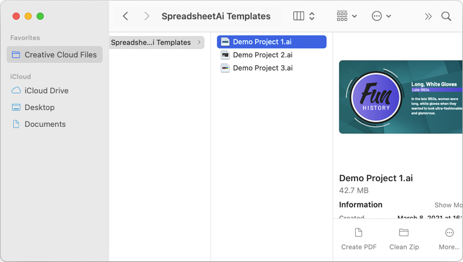
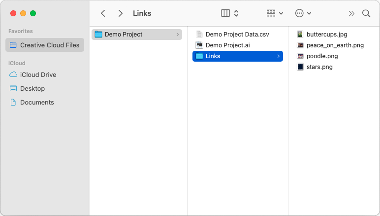
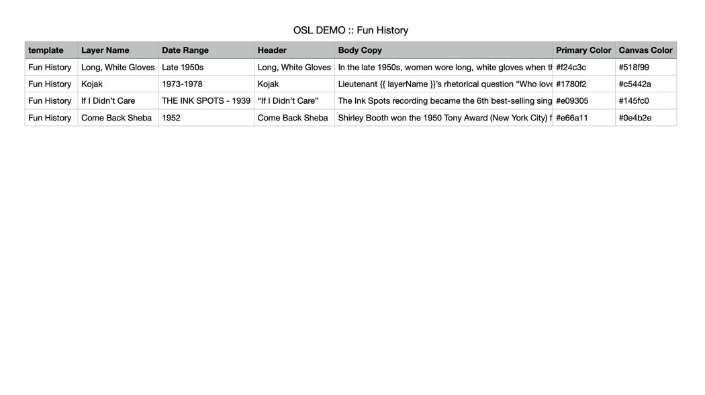

#### 

The aim of the SpreadsheetAi script is to allow the creation of flexible templates which could accept a range of inputs and still have the images size correctly and the text flow naturally.

<!-- Currently I have no doubt that the script will expand and -->

## Installation

Installed like any other Illustrator script; download the script file from [GitHub](https://github.com/Spectrio-Creative/SpreadsheetAi/releases/latest), then add the unzipped .jsx script file to your Illustrator Scripts folder:

Mac: `Applications/Adobe Illustrator <version>/Presets/<lang_REGION>/Scripts`  
Windows: `C:\Program Files\Adobe\Adobe Illustrator <version>\Presets\<lang_REGION>\Scripts` 

Once the script is installed, restart Illustrator (if it’s open) and the script will now be available in the menu  as `File > Scripts > SpreadsheetAi`

## Project Folder Setup

If possible, it’s good practice to bundle the project files, the spreadsheet, and all assets in the same folder.

Since the script directly edits the illustrator file, if the template project file is intended to be reused beyond the specific project, it should be copied into the project directory from its original location to preserve the original template project file.

Images can be kept either in the root of the project folder or in a ‘Links’ sub directory of the project. It’s generally recommended to use the sub directory in order keep the project folder clean.

::: tip
In future, I'm considering having the script create a new AI file by default and place it in the same directory as the spreadsheet.
:::

 |  
:-------------------------:|:-------------------------:
Demo template folder.  | Demo project folder setup.

## Spreadsheet Setup

You may use whatever spreadsheet application you would like to generate the spreadsheet but the sheet must ultimately be given to the script as a .csv file.

The first row of the spreadsheet must be a header column and represents the variable names which will be referenced in your Illustrator template. Each subsequent row represents a new layer in your Illustrator file and the values to be inserted into their respective templates.

Spreadsheet column names should be in sentence case (i.e. First Letter Of Each Word Capitalized).

Column data can reference data in a seperate column by referencing the header of that other column as a camel-case variable surrounded with double-braces (i.e. data from the “Reference Variable” column could be included in another column like `The reference variable is {{ referenceVariable }}`.)

::: warning
Recursive references are not allowed. i.e. the “Primary Variable” value cannot reference `{{ primaryVariable }}`. Nor, for example, could “Second Variable” reference `{{ primaryVariable }}` if “Primary Variable” references `{{ secondVariable }}`, etc.
:::

 |  
:-------------------------:|:-------------------------:
Demo spreadsheet setup.  | Template filled from demo spreadsheet.