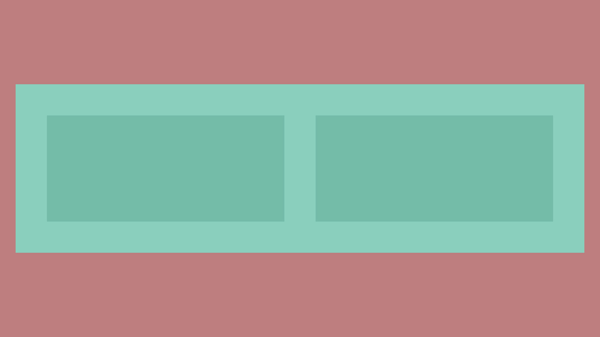
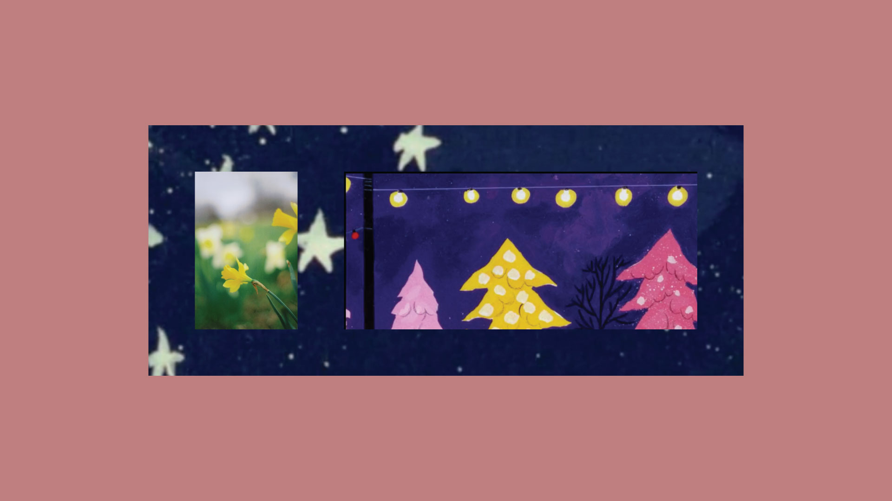

## Introduction

Like with [text](../text/) and [images](../images/), group options can be added to a layer by adding a [JSON](https://www.json.org/json-en.html)-like object to the layer name. For example, a group with an alignment option called 'Content' could be named something like `Content { align: top center }`.

::: warning
It's important to note that multi-word options are not directly supported in the script before version 1.1.0 and have to be wrapped in quotes (i.e. `{ align: top left }` would be `{ align: 'top left' }`). Also in older versions of the script, options that reference spreadsheet row headers have to be represented in camel case (i.e. `{ color: Primary Color }` would have to be `{ color: primaryColor }`).
:::

## Alignment

`{ align: [option] }`

Like image sizing, image alignment is based on the placeholder path item.

Valid assigments are `left`, `right`, `top`, `bottom`, `center`, and `original`.

`{ align: original }` will tell the code _not_ to realign the group even if the group size changes. All other options assume that you will want the group to realign when its size changes. They can be used singularly (such as `{ align: bottom }`) or as a pair (`{ align: top center }`).

It should also be noted that the default alignment when none is given is `center center`.

::: tip
_Note: `{ position: original }` is an alternative shorthand for `{ align: original }`._
:::

_Alignment examples with three groups of images with the same placeholder items but varied resulting lengths._

## Background

Sometimes it’s useful to have a background (be it a color or a image) that scales to the size of the group. This can be achieved by adding the `groupBackground` option to any child layer of the group.

Backgrounds respect the distances from the edges of the group itself for cases where there needs to be some padding around the actual elements in the group.

In the example below we have a layer in the group titled `stars { groupBackground: true, size: cover }`.

 |  
:-------------------------:|:-------------------------:
Template with group containing a background shape with some padding.  | Resized group after running the script with background image resized.