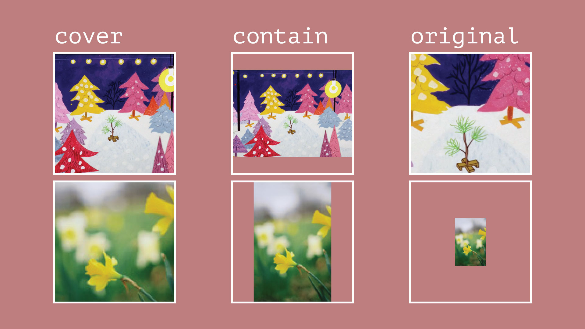
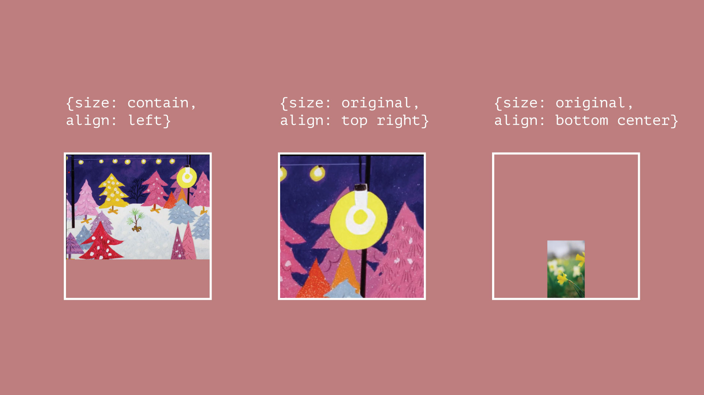

## Introduction

Like with [text](../text/) and [groups](../groups/), image options can be added to a layer by adding a [JSON](https://www.json.org/json-en.html)-like object to the layer name. For example, a layer with a size and alignment option called 'Background' could be named something like `Background { size: cover, align: top center }`.

::: warning
It's important to note that multi-word options are not directly supported in the script before version 1.1.0 and have to be wrapped in quotes (i.e. `{ align: top left }` would be `{ align: 'top left' }`). Also in older versions of the script, options that reference spreadsheet row headers have to be represented in camel case (i.e. `{ color: Primary Color }` would have to be `{ color: primaryColor }`).
:::

## Clipped option

`{ clipped: false }`

By default, images will be masked by their placeholder path item. If you would like the image to overflow beyond its respective placeholder, you can set the `clipped` option to `false`

## Size option

`{ size: [option] }`

Images have three sizing options: `cover`, `contain`, and `original`

The `cover` and `contain` options act like the same words in css. `cover` will size the image to fill the container with minimum overflow while `contain` will size the image to be as large as possible while fitting completely within the container. `original`, on the other hand, will not size the image at all however the image will still be masked to the size and shape of the container.

_All size options demoed. First with a large landscape image and second with a small portrait image._

## Alignment option

`{ align: [option] }`

Like image sizing, image alignment is based on the placeholder path item.

Valid assigments are `left`, `right`, `top`, `bottom`, and `center`.

They can be used singularly (such as `{ align: bottom }`) or as a pair (`{ align: top center }`).

It should be noted that the default alignment when none is given is `center center` but if a horizontal alignment is given, then the vertical alignment default is changed to `top`.

_Alignment examples._

## Group Background

`{ groupBackground: [boolean] }`

See the "[Background](../groups/#background)" section of the [Group documentation](../groups/).
