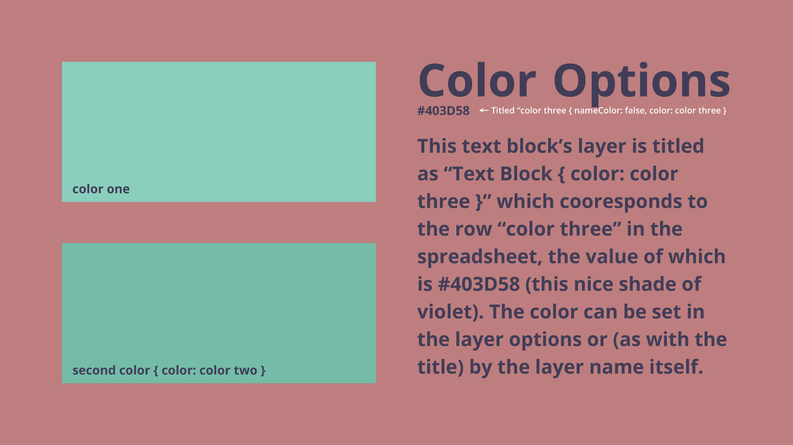
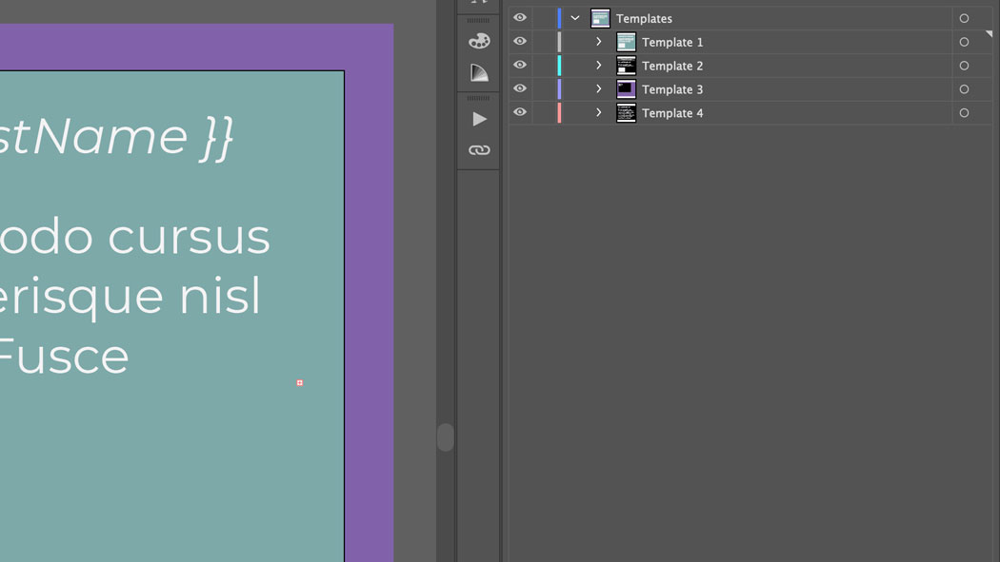

## Introduction

Because the length of copy is, usually, the biggest variable between different designs made from the same template, the bulk of the SpreadsheetAi script's functionality attempts to address text reflowing and resizing.

Like with [image](../images/) and [groups](../groups/), all options can be added to a text layer by adding a [JSON](https://www.json.org/json-en.html)-like object to the layer name. For example, a text layer with a maxHeight and color option called 'Body Copy' could be named something like `Body Copy { maxHeight: 5, color: Primary Color }`.

::: warning
It's important to note that multi-word options are not directly supported in the script before version 1.1.0 and have to be wrapped in quotes (i.e. `{ align: top left }` would be `{ align: 'top left' }`). Also in older versions of the script, options that reference spreadsheet row headers have to be represented in camel case (i.e. `{ color: Primary Color }` would have to be `{ color: primaryColor }`).
:::

## Max Height

`{ maxHeight: [number of lines] }`

Within a template, it is very common that you will have room for text to grow or shrink up to, but not beyond, a certain point. By default, the script will allow the height of your text boxes to grow without limit (and leave the width of the text box at its initial size). You can cap the height of your text box by providing a Max Height property in the layer options.

The Max Height excepts a positive number which can be an integer or include a decimal and represents the maximum the number of lines, at the current text size, that the text box should grow to. If the text reaches it’s maximum height but still overflows the text box, the script will reduce the font size until the remaining text fits within the box.

  |   
:-------------------------:|:-------------------------:
Template with a `{ maxHeight: 5 }` set on the body copy layer. | Resulting graphic with the text resized to fit the maxHeight of the template.

::: tip
If the leading is manually set, the script will not currently adjust it, which can lead to some odd results. This will be addressed in the next itteration of the script but for now, whenever possible, it is recommended that you use the 'auto' setting on the text leading.
:::

## Text Color

`{ color: [spreadsheet header] }`

Variable text color is supported with the SpreadsheetAi script in two ways.

The first is with the `color` keyword in the layer options. To do this, simply reference the spreadsheet row which contains a hexcode color value in the options. For example, if the spreadsheet has a 'Primary Color' row, then you can name the layer `Body Copy { color: Primary Color }`.

The second is to simply name the layer the same as the spreadsheet row header you wish to pull the color from. To use the provious example, you could name the layer simply `Primary Color`.

::: tip
_Note: If you have a value that you want to use for the text field that also happens to be a valid hexcode, you can override using the name as a color with the `nameColor` keyword (i.e. `Primary Color { nameColor: false }`)._
:::

_Result from running script with the following spreadsheet info:_

Template    | Color One | Color Two | Color Three |
:----------:|:---------:|:---------:|:-----------:|
Color demo  | #7AE7C7   | #75BBA7   | #403D58 |

## Inline Variables

Inline variables are variable references that are included in the middle of some other text. When the script is run, the reference variable will be replaced by the data from the spreadsheet and the text on either side of it will remain unchanged. Inline variables, just like input variables, are used by calling the full header of the column holding the data as a camel case (i.e. camelCase) variable surrounded in by double-braces.

In the example below, the template has five layers which each include an inline reference to one of four different spreadsheet columns. The 'firstLine' is referenced twice, once as the title of the poem and once as the first line of th poem.

 |  
:-------------------------:|:-------------------------:
Poem template with inline variables.  | Poem template filled with data from sheet.

::: tip
The layer holding the title of the poem is set to all-caps, so it looks like it’s calling 'FIRSTLINE' but since the text actually typed into the field reads 'firstLine' the reference still works.

It’s also worth noting that the lines of the poem itself do not include any text other than the incoming data and so, a block variable would be entirely appropriate here instead.
:::

## Project File Setup

Templates should be organized as sublayers of a ‘Templates’ layer which should exist in the root of the Illustrator project.

It’s good practice to name each layer in the template, even those layer which will not be editable from the spreadsheet.

 |  
:-------------------------:|:-------------------------:
Demo project containing one template.  | Demo project containing multiple templates.

::: tip
I recommend surrounding non-editable layer labels with asterisks (*) or some other denotation. Especially if the template is one that you intend to re-use often and possibly return to and adjust, being able to tell at a glance which layers are linked to the template and which aren’t can be helpful.
:::